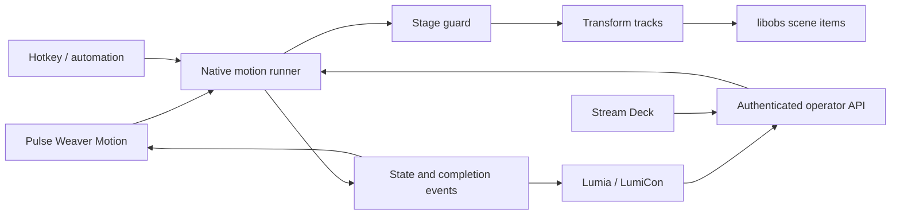

# Native Motion: product and implementation overview

## Goal

Pulse Weaver should own source movement as part of the show rather than require the OBS Move plugin. A streamer creates a clearly named action once and can run that same action from Pulse Weaver, Lumia Stream, LumiCon, Stream Deck, a hotkey, or the local API.

The design keeps existing Pulse Weaver choices: Stages remain the main show model, actions use ordinary language, platform routing stays separate, the app runs directly on libobs, and external controllers receive a limited local operator API.

## User model

The editor uses four ideas:

| Idea | Meaning |
| --- | --- |
| Stage | The part of the show currently on air |
| Layout | Saved positions, crops, sizes, visibility and order for selected sources |
| Action | A named operation such as `Camera close-up` or `Guests side by side` |
| Trigger | A button or automation that asks Pulse Weaver to run an Action |

Users never need to remember slot numbers. Names appear consistently on every controller.

## First preview slice

The `codex/native-motion-engine` preview implements:

- Camera close-up actions with frame-preserving crop and scale compensation.
- Multi-source layout actions captured from the current canvas.
- Stage policies: switch then run, only run on a named Stage, or use the current Stage.
- Animated interpolation, hold, stop, restore, optional return to the previous Stage, and repeat-to-extend for close-ups.
- Manual Stage change ownership: an operator Stage change cancels or restores an active action.
- A shared execution path used by the native UI and local controller API.
- Lumia and LumiCon actions populated from the saved motion catalogue.
- A stable OBS hotkey for every saved action, suitable for Stream Deck's standard Hotkey action.
- Authenticated HTTP endpoints suitable for advanced Stream Deck HTTP actions or a future first-party property inspector.
- Conservative import of Lumia Layout Studio states and absolute OBS Move Source transforms.
- Separate preview installer, portable profile, update channel, port and Lumia plugin identity.

## Editor concept

The Motion page uses a two-column layout. Saved actions are on the left. One plain form is on the right.

The form asks, in order:

1. What should this be called?
2. What should happen?
3. Which Stage owns it?
4. Which scene, group, camera or sources should it control?
5. How quickly should it move and how long should it stay?
6. Should it restore or return to the previous Stage?

A sentence below the form describes the result before saving. Editing never changes output. `RUN / PREVIEW ON OUTPUT` is explicitly labelled because it does.

Advanced details belong behind an optional section in the next iteration: easing curve, focus point, per-source delay, visibility timing, collision policy and nested groups.

## Execution contract

Every entry point calls the same runner.

An execution owns only the scene items listed by its action. It captures their state immediately before movement, retains stable scene item references during the action, and can restore that state. One action runs at a time in the first preview so ownership is unambiguous.

The safe sequence for an action assigned to another Stage is:

1. Validate the Stage and every controlled source without changing output.
2. Capture the restore state.
3. Ask Pulse Weaver to activate the Stage.
4. Wait for the longest saved Stage transition plus a small readiness margin.
5. Re-capture the animation start state and run the tracks.
6. Hold, restore, or leave the saved layout according to the action.
7. Return to the previous Stage only if the operator has not changed Stage since the action began.

## Conflict rules

- A manual Stage change always wins.
- A close-up triggered again extends its hold instead of stacking another crop.
- A second different action is rejected with an understandable message while one is active.
- Stop with restore returns only sources owned by the active execution.
- Restore Last applies only to the most recently completed layout and discards its restore point after use.
- Missing Stage or source references fail before output changes.
- Imported drafts cannot run until the user reviews and saves them.

The later scheduler can allow concurrent actions when their source ownership sets do not overlap. That should be added only with visible conflict resolution in the editor.

## Compatibility import

Compatibility has three separate promises:

1. **Import compatibility:** read useful saved setup from Move and the existing Lumia plugins.
2. **Behaviour compatibility:** reproduce the common visible result with native Pulse Weaver tracks.
3. **Trigger compatibility:** let external controllers run the converted named action.

The preview importer accepts JSON and scans nested structures defensively. It converts Lumia multi-state transforms and absolute Move Source transforms. It reports relative coordinates, filter actions, chained triggers, audio/media operations and exact easing as review items. It never silently interprets unknown fields.

Future import work should read OBS scene collection filter settings directly, show a comparison table, resolve missing sources, and offer `Import`, `Skip`, or `Keep as reference` for each operation.

## Controller surface

Lumia exposes:

- Run motion action, with a dynamic named action list.
- Stop and restore motion.
- Restore the last completed layout.
- Current motion state and current action variables.

The local API exposes the same catalogue, state, run and stop operations. Controller requests may include an idempotency key so retries do not start duplicate executions. Lumia-labelled callers remain restricted to `/api/v1/lumia/*`.

Every saved, reviewed action also registers `Pulse Weaver Motion: <name>` in the OBS hotkey system. A user can assign a key once in Pulse Weaver and select it in Stream Deck without installing another bridge. The hotkey calls the same runner; it cannot bypass Stage or restore rules.

The preview Lumia plugin uses its own ID and port 18765 so it can coexist with the released plugin. A release build can switch the manifest back to the normal plugin ID after migration behaviour is proven.

## Storage

Actions are stored as versioned JSON in the portable profile. Each action uses a UUID and records names plus stable OBS item IDs. Names are retained as a recovery fallback and for readable diagnostics.

No configuration, source media, credentials, logs or recovery backups are packaged in the installer.

## Next iterations

1. Replace transition-duration readiness with explicit Stage route completion signals from the frontend.
2. Add visible focus-point selection for close-ups.
3. Add easing choices and per-source delay with safe defaults.
4. Add a capture/update comparison before overwriting a layout.
5. Add source-set conflict analysis and compatible concurrent actions.
6. Import Move filters directly from scene collections and preserve supported easing/delay fields.
7. Add a first-party Stream Deck property inspector that reads the action catalogue directly.
8. Add action folders, search, duplicate and export/import bundles.
9. Add failure recovery for a source removed during an animation and richer execution history.
10. Promote the preview identity to the release channel only after action migration and uninstall coexistence have been exercised.
